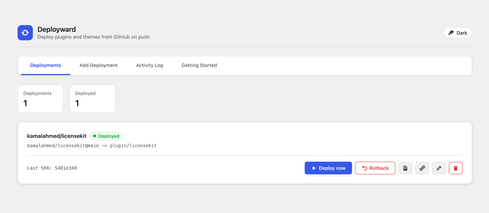
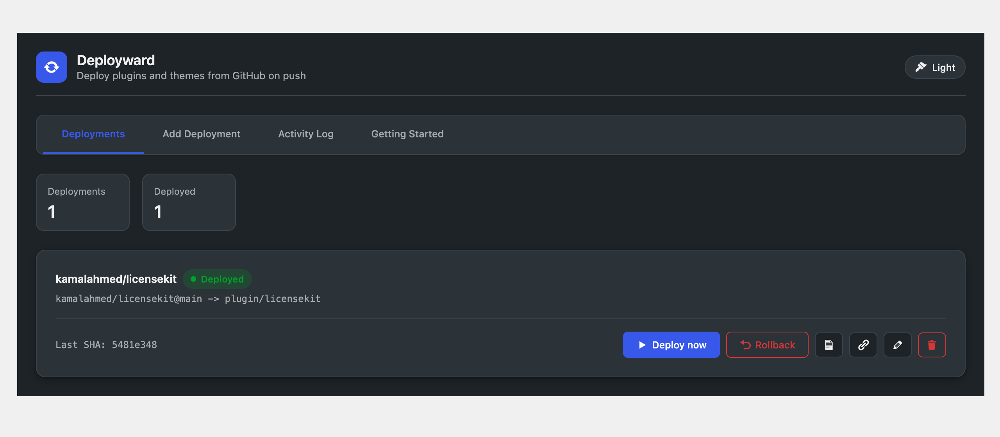
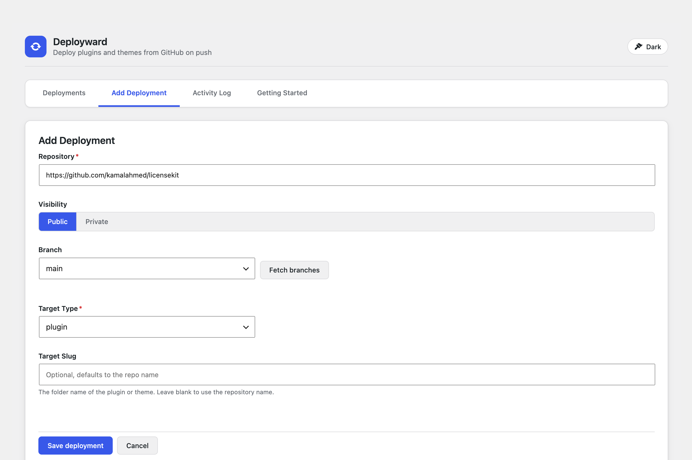
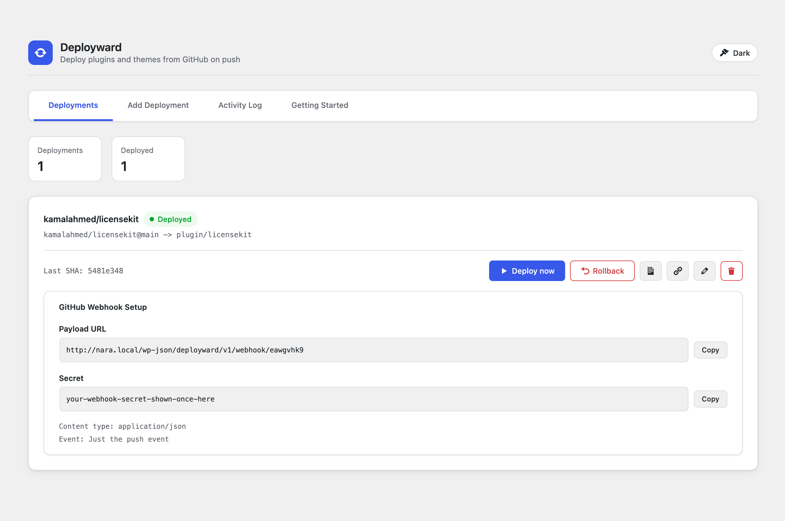
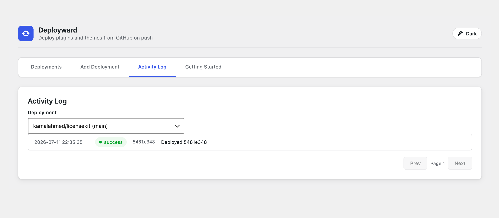

# Deployward

Safely auto-deploy WordPress plugins and themes straight from GitHub. Push to a branch, and Deployward downloads the code, validates it, backs up the current version, swaps the new one in atomically, health-checks the site, and rolls back automatically if anything looks broken.

Built for hosts where git deployment is painful or unavailable (WP Engine and similar managed hosts). No build server, no central service: each site runs its own agent.

- **Works with public and private repositories** (private repos use a GitHub fine-grained personal access token, stored encrypted)
- **Choose your deploy triggers per deployment:** manual only, webhook push, scheduled polling, or both, plus a manual button/CLI command that always works
- **Safety first:** validation, maintenance mode, versioned backups, post-deploy health check, automatic rollback
- **Deploys plugins, themes, and mu-plugins**, each into a folder you choose

## Screenshots

The Deployments dashboard, with one-click deploy, rollback, and per-deployment webhook setup:



Dark mode is built in. It is a per-user choice saved to your WordPress profile, toggled from the header:



Adding a deployment: paste the repository URL (or `owner/repo`), fetch the branch list, pick a target. The slug is optional and defaults to the repository name:



Webhook setup for push-to-deploy. Copy the payload URL and secret into GitHub and every push deploys automatically:



Every deploy, rollback, skip, and failure is recorded in the activity log:



## Requirements

- WordPress 6.0 or newer
- PHP 7.4 or newer
- The web server user must be able to write inside `wp-content` (the same requirement WordPress core has for updating plugins)
- Outbound HTTPS access to `api.github.com`

## Installation

1. Download or build `deployward-<version>.zip` (see [Building a release zip](#building-a-release-zip)).
2. In wp-admin go to Plugins, Add New Plugin, Upload Plugin, choose the zip, install, and activate.
3. A new top-level **Deployward** menu appears in wp-admin.

Or install from a checkout:

```bash
cd wp-content/plugins
git clone https://github.com/kamalahmed/deployward.git
wp plugin activate deployward
```

## Quick start: deploy a public repository

1. Open **Deployward** in wp-admin and go to the **Add Deployment** tab.
2. Paste the repository into the Repository field. All of these work:
   - `owner/repo`
   - `https://github.com/owner/repo`
   - `git@github.com:owner/repo.git`
3. Leave Visibility on **Public**.
4. Click **Fetch branches** and pick the branch to deploy from (usually `main`).
5. Pick the Target Type: `plugin`, `theme`, or `mu-plugin`.
6. Leave Target Slug blank to use the repository name, or set the folder name yourself.
7. Click **Save deployment**, then click **Deploy now** on the Deployments tab.

That is the whole flow. The first deploy creates `wp-content/plugins/<slug>` (or the theme folder) from the branch head.

## Private repositories

Same flow, plus a token:

1. On the Add Deployment form set Visibility to **Private**. A Token field appears.
2. Create a GitHub token: GitHub, Settings, Developer settings, Fine-grained personal access tokens, Generate new token.
   - Repository access: select only the repository you are deploying.
   - Permissions: **Contents: Read-only**. Nothing else is needed.
3. Paste the token into the Token field and save.

The token is encrypted with keys derived from your site's auth salts before it is stored. It is only ever sent to `api.github.com`.

## Automatic deploys

Each deployment has two independent **Deploy triggers**, both off by default: **Webhook**
and **Scheduled check**. Every new deployment (and every deployment saved before this
version) starts strictly manual: nothing deploys until you click **Deploy now**. Edit the
deployment to check one, the other, or both:

- **Manual** (default, both off): nothing deploys automatically.
- **Webhook only**: pushes deploy within seconds, zero polling load on your server or GitHub.
- **Scheduled check only**: works without a webhook, and covers private repositories too
  since the poller uses the same stored token.
- **Both**: webhook for speed, with the scheduled check as a safety net if a webhook
  delivery is ever missed.

The Deployments tab shows a precise badge on each card: **Manual**, **Webhook**,
**Every N min**, or **Webhook + every N min**.

### Webhook trigger (push to deploy)

1. On the Deployments tab, click the **Webhook setup** (link icon) button on a deployment.
2. Copy the Payload URL and the Secret. The URL looks like:
   `https://your-site.com/wp-json/deployward/v1/webhook/<deployment-id>`
3. In the GitHub repository: Settings, Webhooks, Add webhook.
   - Payload URL: paste it
   - Content type: `application/json`
   - Secret: paste it
   - Events: "Just the push event"
4. Save. From now on, every push to the watched branch deploys within seconds. Pushes to other branches are ignored.

Every webhook call is verified with an HMAC signature (`X-Hub-Signature-256`); requests without a valid signature are rejected.

### Scheduled check trigger (polling, no webhook needed)

Deployward polls GitHub via WP-Cron and deploys any new commit on the watched branch, but only for deployments with the Scheduled check trigger checked. Each deployment picks its own check interval: 5, 15, 30, or 60 minutes. A single 5-minute master tick wakes Deployward up; deployments without the Scheduled check trigger are skipped entirely (no GitHub API calls), and enabled deployments are only checked once their own interval has elapsed. This works for private repositories too, since polling reuses the same encrypted token stored for the deployment.

## What happens during a deploy

Every deploy, no matter how it is triggered, runs the same pipeline:

1. **Resolve** the latest commit on the watched branch. If it is already deployed, skip (no useless work).
2. **Download** the zipball from the GitHub API.
3. **Extract** it into a private work directory inside `wp-content/uploads` (same filesystem as the target, so moves are reliable on hosts like WP Engine where the system temp dir lives on a different disk).
4. **Validate** the payload: a plugin must contain a real plugin header, a theme a `style.css` theme header. Random zips never reach your plugins folder.
5. **Maintenance mode on** (the same `.maintenance` mechanism WordPress core uses) so visitors see a maintenance notice, never a half-swapped site.
6. **Backup** the current version into `wp-content/uploads/deployward-backups-*` (the last 3 versions are kept per deployment).
7. **Swap** the new version into place. Directory moves fall back to a file-by-file copy when the filesystem cannot rename across mounts.
8. **Maintenance mode off**, then a **health check**: Deployward requests your homepage (with a cache-buster so a page cache cannot mask a problem). A 5xx response or a fatal-error page triggers an **automatic rollback** to the backup.
9. **Record and notify:** the result lands in the activity log and the site admin gets an email on success or failure.

If a deploy fails at any step, the error message includes the paths involved and the underlying reason (for example `Permission denied`), and the site is left on the previous working version. In the rare case where a rollback itself fails, the log says so explicitly and tells you to restore the latest backup manually; it will never falsely claim the site was rolled back.

Deployward refuses to deploy over itself (the `deployward` plugin folder is protected).

## WP-CLI commands

Everything the UI does is also available via WP-CLI.

| Command | Description |
|---------|-------------|
| `wp deployward add` | Register a new deployment |
| `wp deployward list` | List deployments with id, repo, branch, target, and last deployed commit |
| `wp deployward deploy <id>` | Deploy the latest commit now (`--force` redeploys even when up to date) |
| `wp deployward rollback <id>` | Restore the previous version from backup |
| `wp deployward log <id>` | Show the 20 most recent log entries for a deployment |

### `wp deployward add`

| Option | Required | Description |
|--------|----------|-------------|
| `--repo=<owner-repo>` | yes | GitHub repository as `owner/repo` (a full URL also works) |
| `--branch=<branch>` | no | Branch to watch. Default: `main` |
| `--type=<type>` | no | `plugin`, `theme`, or `mu-plugin`. Default: `plugin` |
| `--slug=<slug>` | no | Target folder name. Default: the repository name |
| `--visibility=<visibility>` | no | `public` or `private`. Default: `public` |
| `--token=<token>` | no | GitHub fine-grained PAT, required for private repos |
| `--id=<id>` | no | Stable id. Generated when omitted |
| `--webhook-deploy` | no | Deploy instantly when GitHub pushes to the watched branch (requires webhook setup). Off by default |
| `--poll-deploy` | no | Check for new commits on a schedule and deploy them. Off by default |
| `--poll-interval=<minutes>` | no | How often to check for new commits when `--poll-deploy` is on: `5`, `15`, `30`, or `60`. Default: `5` |

### Examples

```bash
# Add a public plugin, watching main, folder name taken from the repo
wp deployward add --repo=kamalahmed/licensekit

# Add a private plugin from a URL, watching a staging branch
wp deployward add --repo=https://github.com/acme/acme-core \
  --branch=staging --visibility=private --token=github_pat_XXXXXXXX

# Add a theme into a specific folder
wp deployward add --repo=acme/acme-theme --type=theme --slug=acme

# Add a plugin with both deploy triggers on, checking every 15 minutes
wp deployward add --repo=acme/acme-core --webhook-deploy --poll-deploy --poll-interval=15

# See what is registered (the first column is the id)
wp deployward list
# rin70qvs  kamalahmed/licensekit@main  -> plugin/licensekit  [5481e348]  webhook+poll:15m

# Deploy the latest commit now
wp deployward deploy rin70qvs

# Redeploy the same commit (for example after a manual file change)
wp deployward deploy rin70qvs --force

# Something went wrong? Restore the previous version
wp deployward rollback rin70qvs

# Review what happened and when
wp deployward log rin70qvs
```

## Where things live

| What | Where |
|------|-------|
| Backups (last 3 per deployment) | `wp-content/uploads/deployward-backups-<hash>/<slug>/` |
| Extraction work directory | `wp-content/uploads/deployward-work-<hash>/` (cleaned after every deploy) |
| Activity log | `wp_deployward_log` database table |
| Deployment settings | `wp_options` (one row per deployment, token encrypted, not autoloaded) |
| Webhook endpoint | `POST /wp-json/deployward/v1/webhook/<deployment-id>` |

## Troubleshooting

**"Could not move ... (Permission denied)"**: the web server user cannot write to the target or the uploads directory. Fix the ownership/permissions on `wp-content`; if core plugin updates work in wp-admin, Deployward has what it needs.

**"GitHub returned HTTP 404"** on a private repo: the token is missing, expired, or not scoped to that repository. Recreate the fine-grained token with Contents: Read-only access to the repo.

**"Health check failed, rolled back"**: the new version broke the site; Deployward already restored the previous version. Check the activity log for the reason, fix the code, push again.

**Webhook returns 401**: the secret in GitHub does not match. Re-copy it from the Webhook setup panel.

**Deploys are slow to start after a push without a webhook**: that is the 5-minute polling fallback. Add the webhook for instant deploys.

## Building a release zip

From a checkout of this repository:

```bash
bash bin/build-zip.sh
# or: composer zip
```

This produces `deployward-<version>.zip` (built from the last commit, dev files excluded) ready to upload through Plugins, Add New Plugin, Upload Plugin.

## Development

```bash
composer install
composer test        # PHPUnit (144 tests)
```

The plugin has no runtime Composer dependencies; `vendor/` is only needed for the test suite.

## Security

- Webhook requests are HMAC-verified (`X-Hub-Signature-256`, timing-safe comparison) before the payload is parsed.
- GitHub tokens are encrypted at rest using keys derived from your site's salts.
- The backups and work directories are protected against direct web access.
- All admin REST endpoints require the `manage_options` capability and a REST nonce.
- Deployward will not deploy over its own folder.

## License

GPL-2.0-or-later. Author: Kamal Ahmed.
